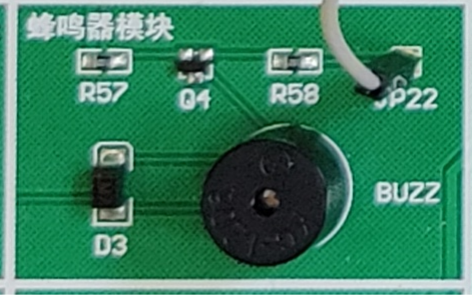

# Stepper Motor Controller Design  

---

## 1. Overview  

This project presents the design of a Stepper Motor Controller based on the AT89C51 microcontroller and L298N driver.  
The system realizes **start/stop, acceleration/deceleration, forward/reverse rotation, and speed setting**. A 4×4 matrix keypad is used for speed and direction input, an 8-digit LED display shows real-time motor speed, and a buzzer provides key feedback.

---

## 2. Design Objective  

### Basic Level  
- Implement a **4×4 keypad** with 16 keys: digits (0–9), shift left/right, start/stop, direction, speed-up/down, confirm/cancel.  
- Use a **7-segment LED display** to show current speed and rotation direction.  
- Integrate **LED indicators** and a **buzzer** for operation feedback.

### Advanced Level  
- Enable **serial communication** with a PC (virtual COM port).  
- Command format: `0xEB, 0x90, CMD, DATA(16-bit)`.  
- Optionally integrate **LCD1602**, **DS18B20 temperature sensor**, or **DS1302 RTC** modules.

---

## 3. System Function Description  

### 4×4 Keypad  
The 4×4 matrix keypad is divided into two parts: numeric keys and function keys.  
The numeric keys (0–9) are used for setting the target speed digits, while the function keys perform operations such as start/stop, forward/reverse rotation, speed setting, cancel setting, and left/right shift.  
When the speed-setting mode is activated, the LED display shows a decimal point that can be shifted left or right, and the digits can be modified by pressing numeric keys.

---

### LED Display  
The LED display shows both the real-time motor speed and the target speed value during configuration.  
When the motor is running, it displays the current rotation speed.  
When the system enters the speed-setting mode, a decimal point appears under the last digit as a cursor.  
The cursor position can be moved by the shift keys, and after confirmation, the display returns to showing the real-time speed.

---

### Stepper Motor  
The stepper motor executes the user-defined target speed and direction.  
After the user sets the target speed and presses the start key, the motor begins rotating at the defined speed.  
When the reverse key is pressed, the motor changes its rotation direction.  
The motor’s rotation speed corresponds to the frequency of pulse signals generated by the microcontroller.

---

### Buzzer  
The buzzer provides feedback when a key is pressed.  
It starts sounding when any key is pressed and stops when the key is released.  
This gives the user an audible indication of the key input.

---

## 4. Hardware Circuit Design

### Proteus Simulation Circuit Diagram

### Physical Wiring Diagram

---

## 5. Hardware Function Planning and Module Interface Principles  

### Crystal Oscillator  
The crystal oscillator circuit provides the clock signal for the AT89C51 microcontroller.  
A 12 MHz crystal and two capacitors are connected to the XTAL1 and XTAL2 pins, forming a parallel resonance circuit that ensures stable clock oscillation within the 6–12 MHz range.  
This clock signal drives the internal timing and execution of all MCU operations.

---

### 4×4 Keypad  
The 4×4 keypad circuit is connected to Port 1 of the microcontroller.  
Pins P1.0–P1.4 are connected to the rows, and pins P1.5–P1.7 are connected to the columns.  
The keypad uses a matrix scanning method: each column line is pulled low in sequence while the row lines are monitored to detect pressed keys.  
This layout allows the system to identify which key is pressed using only eight I/O lines.

---

### 8-Digit LED Display  
The 8-digit LED display is composed of eight 7-segment digits sharing common segment lines.  
The segment lines are connected to Port 0 (P0.0–P0.7), and the digit selection lines are connected to Port 2 (P2.0–P2.7).  
A dynamic display method is used: the microcontroller rapidly switches the active digit and updates its segment data so that only one digit is lit at a time.  
Due to visual persistence, the human eye perceives a continuous display of all digits.

---

### Stepper Motor  
The stepper motor used is a four-phase, six-wire type with a 7.5° step angle and a 5 V operating voltage.  
It is driven by an L298N power amplifier controlled by the AT89C51.  
The microcontroller outputs a sequence of pulse signals to the L298N, which energizes the motor coils in turn.  
By changing the pulse frequency, the system adjusts the motor speed; by changing the excitation sequence, it reverses the rotation direction.

---

### Buzzer  
The buzzer is connected to pin P3.7 of the microcontroller.  
It is a passive buzzer that requires a pulse signal to produce sound.  
The program alternates the output level of P3.7 at a certain frequency, causing the buzzer’s membrane to vibrate and emit sound.  
Because the microcontroller’s output current is small, a current-amplifying circuit is used to drive the buzzer effectively.

---

## 5. Software Design  

### Program Overview  
The software of the system is written in C language and compiled using Keil C51.  
It controls the overall process of the stepper motor operation, including keypad scanning, speed control, display refreshing, and serial communication.  
Each functional block is implemented as an independent subroutine, and timer interrupts are used to generate periodic tasks for real-time response.  

---

### Functional Modules  

#### (1) 4×4 Keypad Scanning  
The program continuously scans the keypad rows and columns.  
When a key is pressed, the program detects a change in the row signal and identifies the corresponding key value.  
A short delay is added for debounce, and the buzzer is activated during the keypress.  

#### (2) Key Function Processing  
After obtaining a key value, the system executes the corresponding function:  
- Start/stop control  
- Direction switching  
- Entering or exiting the speed-setting mode  
- Confirming or cancelling speed configuration  

#### (3) Motor Direction Control  
The motor direction is determined by the flag variable.  
When the direction key is pressed, the flag is toggled, and the output excitation sequence changes accordingly, achieving forward or reverse rotation.

#### (4) Real-Time Speed Display  
The LED display is refreshed dynamically using a timer interrupt.  
When the system is in normal operation, it shows the real-time motor speed.  
During speed configuration, the display switches to show editable speed digits and the cursor indicator.

#### (5) Shift Operation  
Left and right shift keys are used to move the decimal point (cursor) across the digits during speed configuration.  
The currently selected digit can then be changed by pressing a numeric key.

#### (6) Target Speed Setting  
After entering new speed digits, the system calculates the pulse delay value based on the target speed.  
Once confirmed, the new speed replaces the previous one, and the display returns to real-time mode.

#### (7) Timer Interrupt  
Timer 0 generates a 1 ms interrupt period.  
It controls motor stepping, LED display refreshing, and speed display switching.  
When the timer count reaches the calculated value, a pulse is sent to drive the stepper motor.

#### (8) Serial Communication  
The UART interrupt is used to receive serial data.  
When data is received, it is stored in a buffer and processed as a simulated key input.  
This enables simple PC-side control of motor actions.

The complete code is shown below:
[Stepper Motor Control](./Code/Stepper_Motor_Control.c)

---

